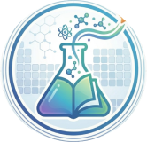

# 🧪 ChemLearn - Virtual Chemistry Laboratory

<div align="center">



**A comprehensive mobile virtual chemistry laboratory application for secondary and high school students**

[](https://flutter.dev/)
[](https://firebase.google.com/)
[](LICENSE)

[Features](#-features) • [Screenshots](#-screenshots) • [Installation](#-installation) • [Documentation](#-documentation) • [Reports](#-project-reports)

</div>

---

## 📋 Table of Contents

- [About](#-about)
- [Features](#-features)
- [Technology Stack](#-technology-stack)
- [Project Structure](#-project-structure)
- [Installation](#-installation)
- [Running the App](#-running-the-app)
- [Project Reports](#-project-reports)
- [Admin Dashboard](#-admin-dashboard)
- [Contributing](#-contributing)
- [License](#-license)

---

## 🎯 About

ChemLearn is a mobile virtual chemistry laboratory designed to make chemistry education more accessible, engaging, and safe for students. The app provides interactive simulations of chemistry experiments, educational games, quizzes, and comprehensive progress tracking.

**Key Benefits:**
- ✅ Safe experimentation without physical hazards
- ✅ Unlimited practice opportunities
- ✅ Cost-effective alternative to physical labs
- ✅ Accessible anytime, anywhere
- ✅ Real-time progress tracking

---

## ✨ Features

### 🔬 Laboratory Modules (7 Labs)

1. **Chemical Mixing Lab** - Mix different chemicals and observe realistic reactions
2. **Combustion Lab** - Simulate burning reactions with visual effects
3. **Electrolysis Lab** - Demonstrate electrolytic processes
4. **Quantitative Analysis Lab** - Practice titration with 160 combinations (20 analytes × 8 titrants)
5. **Reaction Kinetics Lab** - Explore factors affecting reaction rates
6. **Equation Balancing Lab** - Interactive chemical equation balancing
7. **Equipment Selection Lab** - Learn proper laboratory equipment usage

### 🎮 Educational Games (6 Games)

- **Memory Game (Ghi Nhớ)** - Match chemistry terms and formulas
- **Word Building (Ghép Từ)** - Construct chemical terms
- **Quick Quiz (Quiz Nhanh)** - Rapid-fire chemistry questions
- **Molecule Building (Xây Dựng Phân Tử)** - Build molecular structures
- **Synthesis Game (Tổng Hợp)** - Combine elements to create compounds
- **Leaderboard** - Compete with other students

### 📚 Learning Features

- **Interactive Periodic Table** - All 118 elements with detailed information
- **Quiz System** - Multiple categories with instant feedback
- **Progress Tracking** - Detailed statistics and achievements
- **Daily Streak** - Encourage regular learning
- **Achievement System** - Unlock badges and rewards

### 🔐 Authentication

- Email/Password registration and login
- Google Sign-In (OAuth)
- Facebook Login (OAuth)
- Password reset functionality

### 👨‍💼 Admin Dashboard

- User management (CRUD operations)
- Real-time analytics
- Activity monitoring
- System statistics

---

## 🛠 Technology Stack

### Mobile App
- **Framework:** Flutter 3.11.4
- **Language:** Dart 3.11.4
- **State Management:** Provider 6.1.2
- **UI Design:** Material Design

### Backend Services
- **Authentication:** Firebase Auth 5.3.4
- **Database:** Cloud Firestore 5.5.2
- **Storage:** Firebase Storage
- **Analytics:** Firebase Analytics

### Authentication Providers
- **Google Sign-In:** google_sign_in 6.2.1
- **Facebook Login:** flutter_facebook_auth 7.1.1

### Admin Dashboard
- **Frontend:** HTML5, CSS3, JavaScript
- **Backend:** Firebase SDK

---

## 📁 Project Structure

```
ChemLearn-Complete-Project/
├── virtual_chemistry_lab/          # Main Flutter app
│   ├── lib/
│   │   ├── constants/              # App constants and colors
│   │   ├── models/                 # Data models
│   │   ├── providers/              # State management
│   │   ├── screens/                # UI screens
│   │   │   ├── auth/              # Login, Register
│   │   │   ├── home/              # Dashboard
│   │   │   ├── lab/               # Laboratory modules
│   │   │   ├── game/              # Educational games
│   │   │   ├── course/            # Periodic table, lessons
│   │   │   └── profile/           # User profile, settings
│   │   ├── services/              # Business logic
│   │   ├── widgets/               # Reusable widgets
│   │   └── main.dart              # App entry point
│   ├── assets/                    # Images, JSON data
│   ├── admin_dashboard/           # Web admin panel
│   ├── android/                   # Android configuration
│   ├── ios/                       # iOS configuration
│   └── pubspec.yaml              # Dependencies
├── ChemLearn_Report_Complete.md   # Full project report (Chapters 1-3)
├── ChemLearn_Report_Remaining.md  # Report continuation (Chapters 4-5, References)
├── ChemLearn_UseCase.puml         # Use Case Diagram (PlantUML)
└── README.md                      # This file
```

---

## 🚀 Installation

### Prerequisites

Before you begin, ensure you have the following installed:

1. **Flutter SDK** (3.11.4 or higher)
   ```bash
   # Download from: https://flutter.dev/docs/get-started/install
   flutter --version
   ```

2. **Dart SDK** (3.11.4 or higher) - Included with Flutter

3. **Android Studio** or **VS Code** with Flutter extensions

4. **Git**
   ```bash
   git --version
   ```

5. **Firebase CLI** (optional, for admin dashboard)
   ```bash
   npm install -g firebase-tools
   ```

### Clone the Repository

```bash
git clone https://github.com/tienphse181722/virtual_chemistry_lab.git
cd virtual_chemistry_lab
```

### Install Dependencies

```bash
cd virtual_chemistry_lab
flutter pub get
```

### Firebase Configuration

1. Create a Firebase project at [Firebase Console](https://console.firebase.google.com/)

2. Add Android app:
   - Package name: `com.example.virtual_chemistry_lab`
   - Download `google-services.json`
   - Place in `android/app/`

3. Add iOS app (optional):
   - Bundle ID: `com.example.virtualChemistryLab`
   - Download `GoogleService-Info.plist`
   - Place in `ios/Runner/`

4. Enable Authentication providers:
   - Email/Password
   - Google Sign-In
   - Facebook Login (optional)

5. Create Firestore database in production mode

6. Set up Firebase Security Rules (see documentation)

---

## 🏃 Running the App

### Check Connected Devices

```bash
flutter devices
```

### Run on Android Emulator

```bash
flutter run -d emulator-5554
```

### Run on Physical Device

```bash
flutter run
```

### Build APK (Release)

```bash
flutter build apk --release
```

The APK will be located at: `build/app/outputs/flutter-apk/app-release.apk`

### Build iOS (macOS only)

```bash
flutter build ios --release
```

---

## 📖 Project Reports

This repository includes comprehensive project documentation:

### 📄 Report Files

1. **ChemLearn_Report_Complete.md**
   - Chapter 1: Introduction
   - Chapter 2: Similar Projects and Products
   - Chapter 3: System Analysis and Design (Part 1)

2. **ChemLearn_Report_Remaining.md**
   - Chapter 3: System Analysis and Design (Part 2)
   - Chapter 4: System Implementation and Testing
   - Chapter 5: Summary and Conclusion
   - References (20 academic sources)
   - Appendix (10 sections)

3. **ChemLearn_UseCase.puml**
   - Use Case Diagram in PlantUML format
   - Generate image at: https://plantuml.com/

### 📊 Report Contents

The reports include:
- ✅ Complete system analysis and design
- ✅ Technical specifications
- ✅ Code examples and implementations
- ✅ Testing results and user feedback
- ✅ UML diagrams (Use Case, Sequence, ERD, DFD)
- ✅ Database schema
- ✅ User interface designs
- ✅ Installation and user manuals

### 🔍 How to Read the Reports

**Option 1: GitHub (Recommended)**
- View directly on GitHub with proper Markdown rendering
- Navigate to the files in the repository

**Option 2: VS Code**
- Open the `.md` files in VS Code
- Press `Ctrl+Shift+V` (Windows) or `Cmd+Shift+V` (Mac) for preview

**Option 3: Markdown Viewer**
- Use any Markdown viewer/editor
- Examples: Typora, MarkText, Obsidian

---

## 👨‍💼 Admin Dashboard

### Access the Dashboard

1. **Local Development:**
   ```bash
   cd virtual_chemistry_lab/admin_dashboard
   # Open index.html in a web browser
   ```

2. **Firebase Hosting (Production):**
   ```bash
   firebase deploy --only hosting
   ```

### Admin Credentials

**Default Admin Account:**
- Email: `admin@chemlab.com`
- Password: `Admin@123`
- User ID: `mRb3wSjSg2bedDtc45wvQgVupzE2`

### Dashboard Features

- 📊 Overview statistics
- 👥 User management (View, Edit, Delete)
- 📈 Analytics and charts
- 📝 Activity logs
- ⚙️ System settings

---

## 🎓 For Students and Teachers

### How to Use the App

1. **Register/Login:**
   - Create account with email or use Google/Facebook
   
2. **Explore Labs:**
   - Navigate to "Labs" tab
   - Choose from 7 laboratory modules
   - Follow instructions and perform experiments
   
3. **Take Quizzes:**
   - Go to "Quiz/Games" tab
   - Select quiz category
   - Answer questions and get instant feedback
   
4. **Play Games:**
   - Access educational games
   - Earn points and compete on leaderboard
   
5. **Track Progress:**
   - View dashboard for statistics
   - Check achievements and streak
   - Review activity history

### For Teachers

- Use admin dashboard to monitor student progress
- View analytics to identify struggling students
- Generate reports for assessment
- Manage user accounts

---

## 🧪 Testing

### Run Tests

```bash
flutter test
```

### Test Coverage

```bash
flutter test --coverage
```

### Integration Tests

```bash
flutter drive --target=test_driver/app.dart
```

---

## 🐛 Troubleshooting

### Common Issues

**1. Build Failed - Gradle Error**
```bash
cd android
./gradlew clean
cd ..
flutter clean
flutter pub get
flutter run
```

**2. Firebase Not Configured**
- Ensure `google-services.json` is in `android/app/`
- Check Firebase project settings
- Verify package name matches

**3. Google Sign-In Not Working**
- Enable Google Sign-In in Firebase Console
- Add SHA-1 fingerprint to Firebase project
- Rebuild the app

**4. Facebook Login Issues**
- Facebook App must be in "Live" mode (not Development)
- Add OAuth redirect URI in Facebook Developer Console
- Configure Facebook App ID in `strings.xml`

---

## 📱 Screenshots

### Mobile App

| Login Screen | Dashboard | Lab Selection |
|-------------|-----------|---------------|
|  |  |  |

| Chemical Mixing | Periodic Table | Quiz |
|----------------|----------------|------|
|  |  |  |

### Admin Dashboard

| Overview | User Management | Analytics |
|----------|----------------|-----------|
|  |  |  |

---

## 🤝 Contributing

Contributions are welcome! Please follow these steps:

1. Fork the repository
2. Create a feature branch (`git checkout -b feature/AmazingFeature`)
3. Commit your changes (`git commit -m 'Add some AmazingFeature'`)
4. Push to the branch (`git push origin feature/AmazingFeature`)
5. Open a Pull Request

---

## 📝 License

This project is licensed under the MIT License - see the [LICENSE](LICENSE) file for details.

---

## 👥 Authors

- **Tiến Phạm** - *Initial work* - [@tienphse181722](https://github.com/tienphse181722)

---

## 🙏 Acknowledgments

- Flutter team for the amazing framework
- Firebase team for backend services
- Chemistry teachers for content validation
- Test users for valuable feedback
- Open source community

---

## 📞 Contact

- **GitHub:** [@tienphse181722](https://github.com/tienphse181722)
- **Repository:** [virtual_chemistry_lab](https://github.com/tienphse181722/virtual_chemistry_lab)

---

## 🌟 Star History

If you find this project useful, please consider giving it a ⭐!

---

<div align="center">

**Made with ❤️ for Chemistry Education**

[⬆ Back to Top](#-chemlearn---virtual-chemistry-laboratory)

</div>
